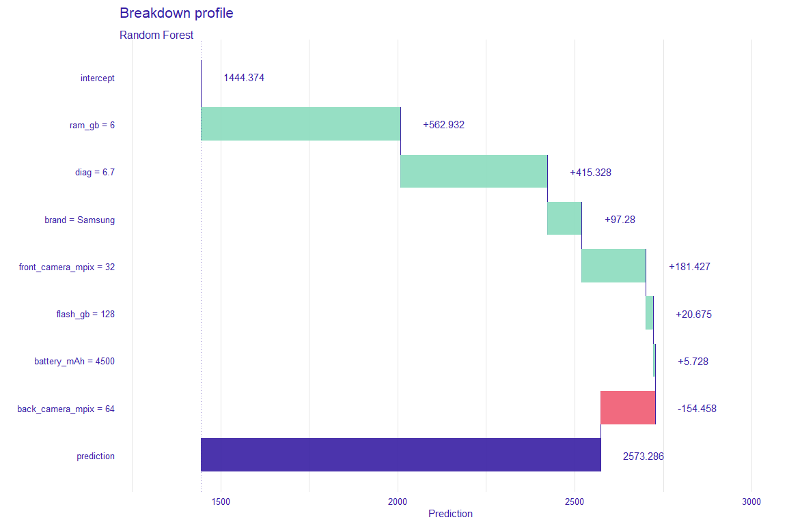
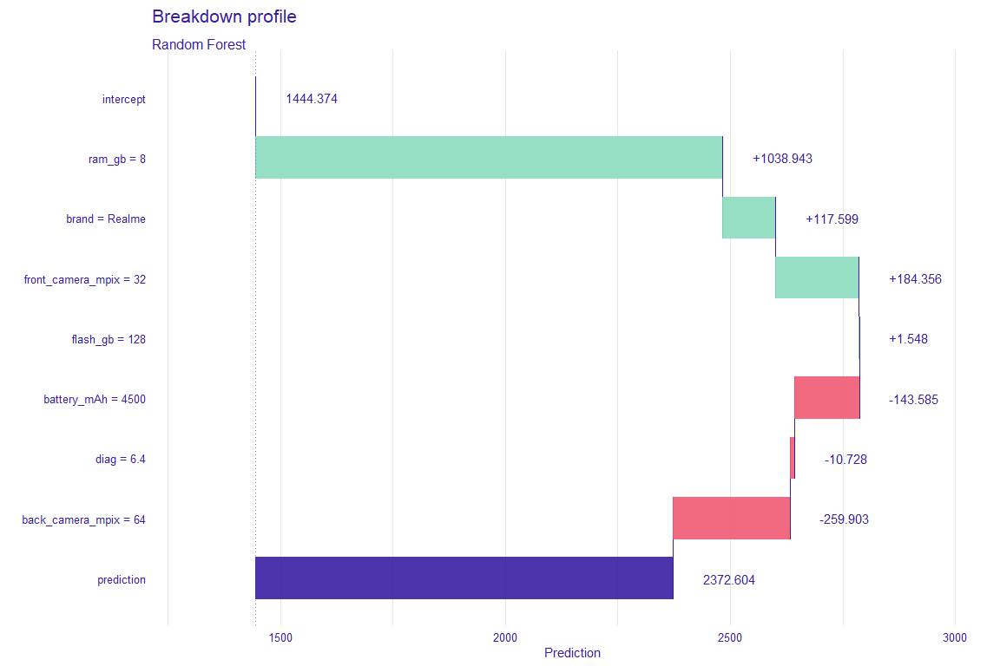
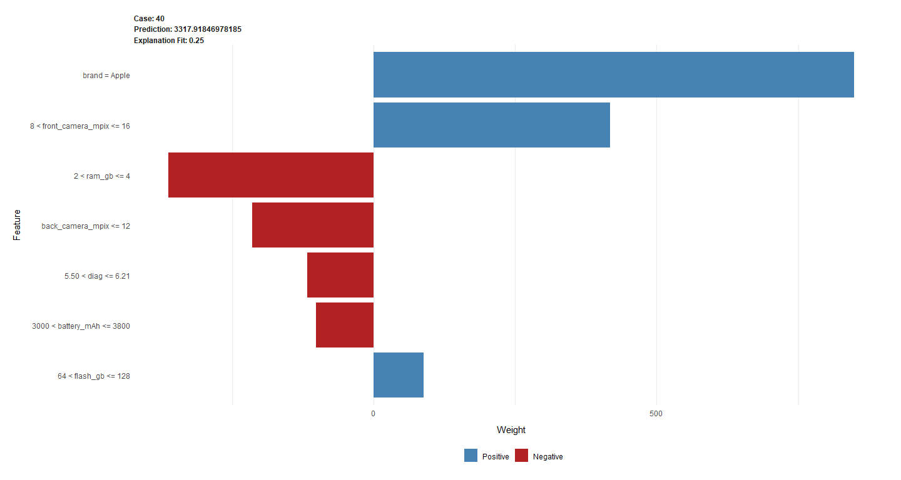
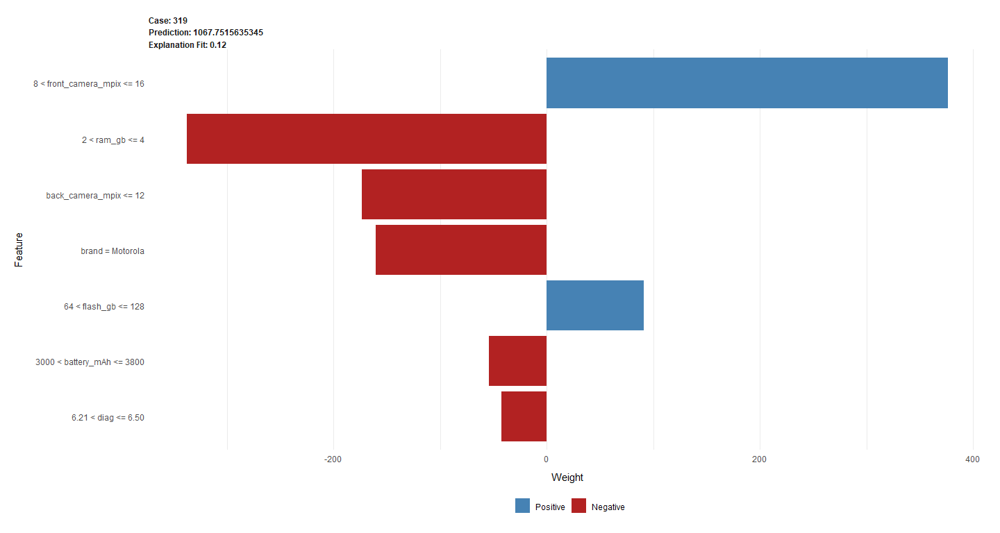
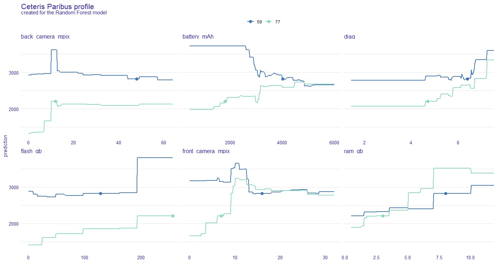
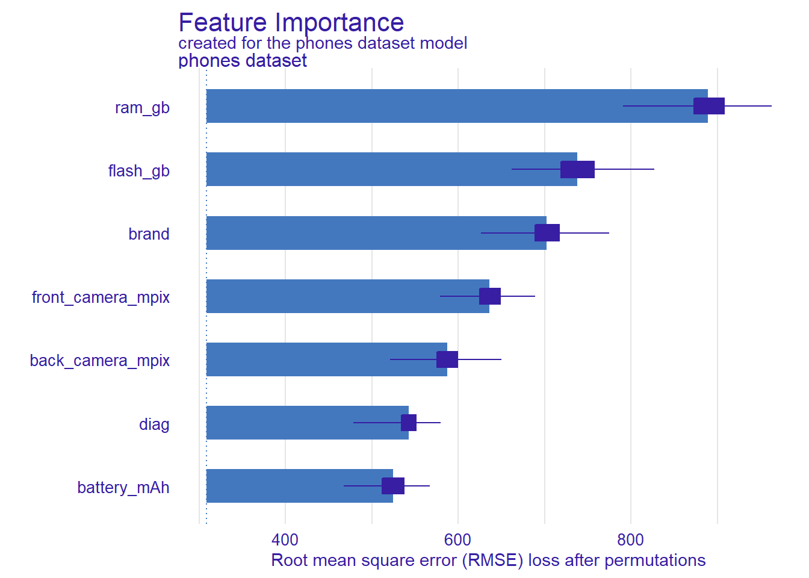

```{r setup, include=FALSE}
knitr::opts_chunk$set(echo = FALSE)
knitr::opts_chunk$set(warning = FALSE)
library(GGally)
library(knitr)
```

### Abstract

### Introduction and Motivation

Mobile phones, since their coming onto the market, have gradually entered people everyday life. According to GSMA, almost 70% of the world's population has one. This market has gained significant popularity in 2007, with the introduction of Apple's iPhone. It revolutionized the industry by offering features such as a touch screen interface and a virtual keyboard. The smartphone market has been steadily developing and growing since then, both in size, as well as in models and suppliers. Smartphone, due to its mobility and computer abilities, has become a source of entertainment, a communication tool, a search engine and so much more.

Suppliers constantly outdo each other introducing new improvements, better cameras or batteries, to attract customers. One could wonder which of them (or whether all of them) cause the price increase. Another question is, whether the price depends on the manufacturer - are there certain producers whose phones are more expensive, no matter the parameters? The task of determining a relationship between a smartphone's features, brand, and the price is surely non-trivial.

In such a problem, machine learning can be useful. Machine learning algorithms step into more and more areas of our life. We use them in risk analysis, medical diagnosis or credit approval, so why could they not be used in phones pricing? In general, we can distinguish two types of models: glass-box, which steps can be followed from inputs to outputs, and black-box, which do not have a readable way of determining predictions. In many cases, such as the one considered in this article, simple interpretable models are not capable of dealing with our problem satisfyingly, so we turn to more complex, non-transparent ones, which grant us higher accuracy, but lower understanding, and therefore, lower trust. Explainable Artificial Intelligence (XAI) addresses this problem. It is a set of tools to help you understand and interpret predictions made by your machine learning models. With it, one can debug and improve model performance, and help others understand models' behaviour.

In the article below, we deal with the problem of creating an explainable regressor for mobile phones prices. We build a black-box model and then use XAI methods to find out which features and brands contribute mostly to the final price. 

### Related work

Ha Ngoc Anh (https://core.ac.uk/download/pdf/80990944.pdf) shows changes in the mobile industry and competition between various smartphone companies and brands. There are also papers, which use Machine Learning tools to answer the question of predicting prices by various models and neural networks. Ibrahim M. Nasser et.al. (https://philarchive.org/archive/KHIAFP) proves the point in predicting smartphone prices with the use of neural networks. And Ritika Singh (@xai2-phones-eda) examines the importance of various features in predicting smartphone prices.

In this article Explainable Artificial Intelligence methods were used to address the problem. They were described by Przemysław Biecek et.al. in "Explanatory Model Analysis" book (@EMA), with local methods as Break-down, Shapley and Ceteris-Paribus; and global as Partial-dependence profiles being explained there. Also, more explanations about XAI are to be found in articles about LIME (@xai1-lime) and ALE (@xai1-ale) plots.


### Methodology

#### Data description

Research was carried out on the *phones* dataset provided by the lecturer i. e. data frame with prices and technical parameters of 414 phones. It contains ten explanatory variables and one target variable (`price`), therefore we deal with regression task. The sample of the data is presented below.

```{r description}
phones <- read.csv("./phones.csv")
knitr::kable(head(phones, 3))
```

#### Exploratory Data Analysis and data preprocessing

At the beginning of our research we conducted Exploratory Data Analysis to get better understanding of the data we deal with. We mainly focused on the target variable and its distribution versus explanatory ones to identify potential influential features for our prediction. Below we present some results important for further work.

```{r mean-price, fig.align="center", fig.cap='TODO'}
knitr::include_graphics('images/2-1-eda-mean-price.png')
```

```{r violin, fig.align="center", fig.cap='TODO'}

```

```{r corr, fig.align="center", fig.cap='Correlation matrix'}

```

Based on the partially presented EDA, we needed to conduct simple data preprocessing before modeling. Following steps were executed:

* ***handling missing values:*** Two features containing missing values were identified; both related to camera parameters (`back_camera_mpix`, `front_camera_mpix`). Those values turned out to be meaningful, as they mean that given mobile phone has no camera (back or front). Given that information, NAs were imputed with a constant value - 0.
* ***removing outliers:*** Based on features distribution, some extreme values were identified in the dataset's explanatory variables (`back_camera_mpix`, `front_camera_mpix`, `battery_mAh`, `flash_gb`, `price`), which would weaken the model's performance. Therefore they were removed.
* ***dealing with unimportant and correlated features:*** The variable `name` has been omitted, because it was practically unique in the dataset and naturally connected to the `brand` feature. Moreover, `height_px` and `width_px` were deleted due to their strong correlation with the `diag` feature (and with each other); this feature was considered as a sufficient determinant of the phone's dimensions.

#### Models

Next step after EDA was creating prediction models. To compare results and find the best model for mentioned data, there were created 3 models: ranger, xgboost and svm. Every model used cross validation during trainning. Svm and xgboost models cannot be trained using character variables so variable `brand` needed to be target encoded in these cases. There were used two measures to compare models results: root mean square error (rmse) and mean absolute error (mae). The results are presented in the table below.

```{r models}
models <- data.frame(rmse = c(547, 1515, 678), mae = c(295, 1033, 376), row.names = c('ranger', 'xgboost', 'svm'))
knitr::kable(models)
```

Presented results clearly point, that ranger model is the best choice. This model was used in further analysis.

### Results

Ranger model results have been analyzed using Explainable Artificial Inteligence methods. Following paragraphs present local and global explainations.

#### Local explainations

In the first step of our XAI, the focus was on instance level explanations - analysis of single predictions and how each feature influences their values. Break down, SHAP, Lime and Ceteris Paribus profiles were used to show dependencies and draw conclusions. The drawback of those methods is that for each observation results can differ greatly. That is why they cannot be used to assume general ideas for a whole data set. Therefore below we present only the most interesting observations found during the research. They were grouped into pairs to show how identical parameters, but different brands can lead to totally different prices or vice versa.

#### First example


```{r breakdown-table}
kable(phones[c(21,263),-c(1,9,10)], row.names=FALSE)
```

```{r breakdown-plot20, fig.align="center", fig.cap='Breakdown profile for observation 20'}

```

```{r breakdown-plot246, fig.align="center", fig.cap='Breakdown profile for observation 246'}

```

Shown above two observations (img_bd_21, img_bd_263) vary three features - *ram_gb*, *brand* and *diag*. It is visible on these two Breakdown charts that Samsung has a bigger diagonal, but less RAM GB and according to the model is more expensive by 200. However, this difference in reality is higher, Samsung is more expensive by 700. There are also differences in the impact of features - in first *batter_mAh* has a positive impact and in the second negative. In the first case for model the most important were *ram_gb*, *diag* and *brand* (in this order), in second *ram_gb*, *brand* and *front_camera_px*. The question is, whether in reality *brand* does not have bigger impact on price than shown here? 

#### Second example


```{r lime-table}
kable(phones[c(40,319),-c(1,9,10)], row.names=FALSE)
```

```{r lime-plot-40, fig.align="center", fig.cap='A plot of results of LIME method for 40 observation'}

```

```{r lime-plot-319, fig.align="center", fig.cap='A plot of results of LIME method for 319 observation'}

```

On LIME plots (img_lime_40, img_lime_319) two phones, which have similar values in many features, in two (*battery_mAh* and *diag*) second phone (img_lime_319) has better values than first one (img_lime_40). Even though the price of the first phone is three times higher according to our model. The only difference not mentioned above between them is a brand - the first one is iPhone. That seems to be a conclusion consistent with reality.

#### Third example

```{r ceteris, fig.align="center", fig.cap='Ceteris Paribus profile'}

```

Ceteris Paribus profile shows different influence of some features concerning (img_ceteris_59, img_ceteris_77) two mobile phones. The biggest contrast we can observe in case of *battery_mAh*, which lowers the price significantly in case of OPPO phone, and increases when it comes to Apple one, leading to the same prediction for both if the value exceeds 5000 mAh. It is quite surprising because in case of the first one such battery parameters should lead to a bigger price. Another difference which can be observed in `front_camera_mpix` influence - whereas above ~ 15 Mpix we reach similar price, for smaller values it causes prediction's increase for Apple, and steady value for OPPO (for both peaks around 10 Mpix value). Once more those impacts are unexpected because OPPO phone has a much better front camera. 
#### Global explainations

This part of the report explains model's predictions using all of the records from dataset.

```{r feat-importance, fig.align="center", fig.cap='Feature importance'}

```

Feature importance plot presents which variable has the most significant impact on prediction result. According to this plot, the most important variables for the ranger model were `ram_gb`, `flash_gb` and `brand`. Two of them are memory parameters which are arguably the most important phone's technical parameters. The third variable describes phone's brand name, which is not a technical parameter.

```{r pdp, fig.align="center", fig.cap='Partial Dependence Profile (PDP)'}

```
### Summary and conclusion

To summarize, according to all explanations shown above, there are several conclusions, which can be drawn. The biggest impact on the predicted price for the model had `brand`, `ram_gb` and `flash_gb`. The most expensive brands as Samsung and Apple have biased prices, they are higher than predicted by the model. What is important to highlight is that these conclusions were made for this specific data set, which had only eleven features at the beginning. This may mean, that for bigger data set, with more features, the results could be slightly different. Such sets can be the subject of further research.


