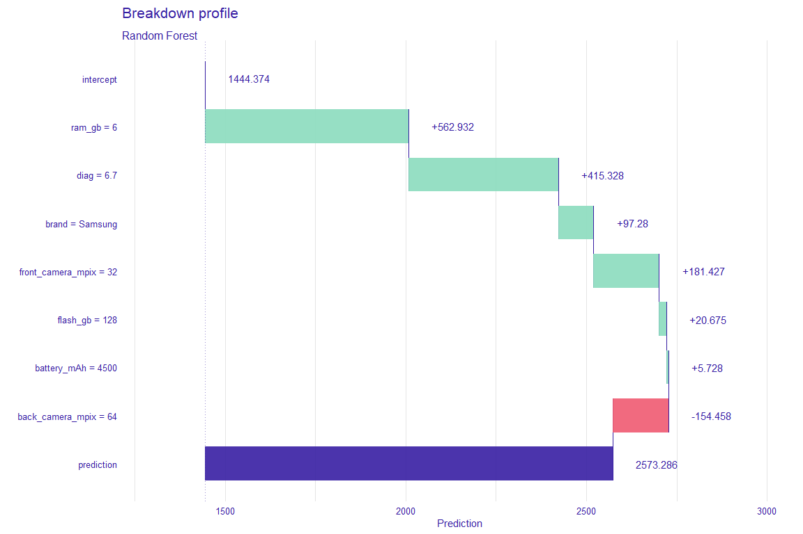
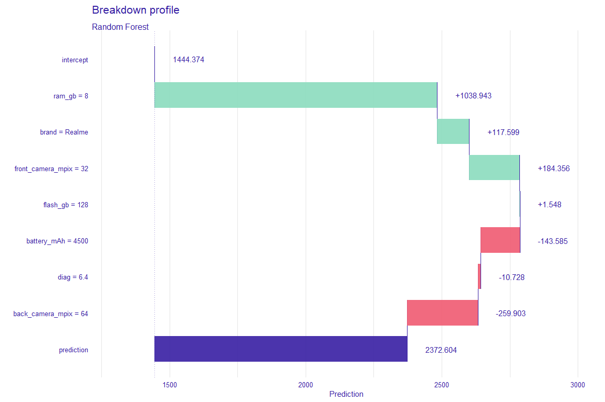
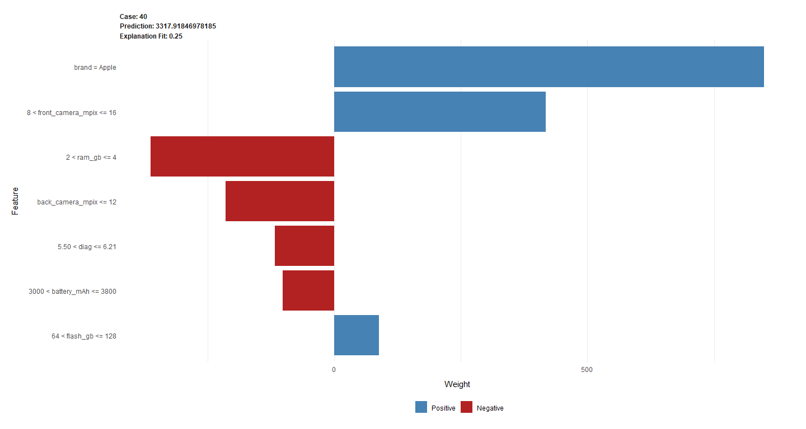
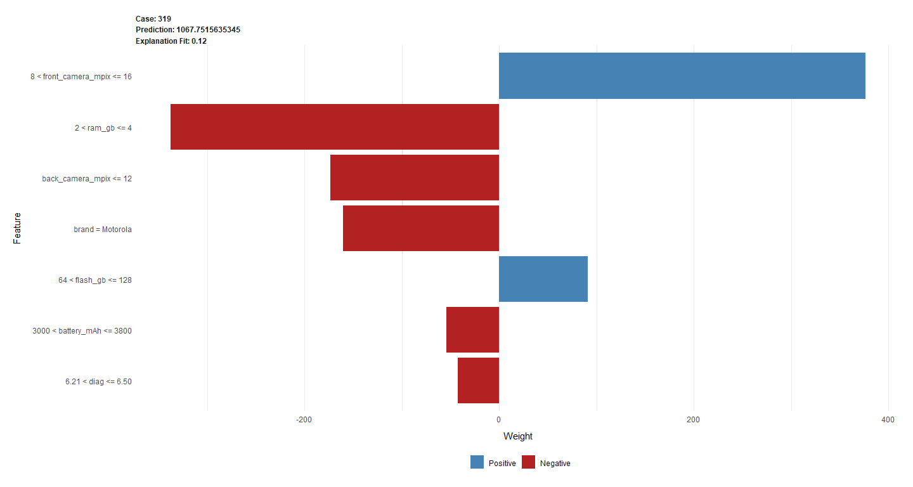
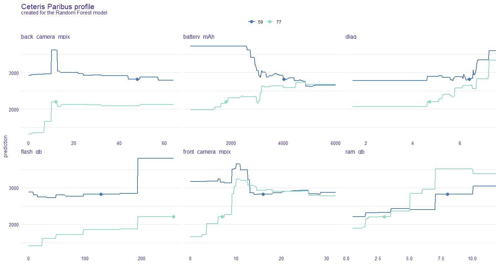
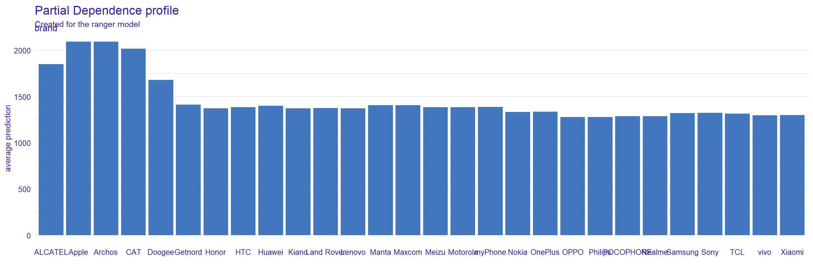

## Does brand has an impact on smartphone prices? {#xai2-phones}

*Authors: Agata Kaczmarek, Agata Makarewicz, Jacek Wiśniewski (Warsaw University of Technology)*

### Abstract

Mobile phone became indispensable item in our daily life. From a simple device enabling contacting other people, it developed into a tool facilitating web browsing, gaming, creating/playing multimedia and much more. Therefore, the choice of phone is an important decision, but given the wide variety of models available nowadays, it is sometimes hard to choose the best one and also easy to overpay.
In this paper, we analyze the phone market to investigate whether the prices of the phones depend only on their technical parameters, or some of them have an artificially higher price regarding the possessed functionalities. Research is conducted on the *phones* dataset, provided by the lecturer, containing prices and features of different phones. As a regressor, Random Forest from package *ranger* [@2-1-ranger] was chosen.Given the type of the model (blackbox i.e. non-interpretable), we use Explainable Artificial Intelligence (XAI) methods from *DALEX* and *DALEXtra* packages [@2-1-dalex, @2-1-DALEXtra], for both local and global explanations, to interpret its predictions and get to know which features influence them the most, and raise (or lower) the price of the phone.

### Introduction and Motivation

Mobile phones, since their coming onto the market, have gradually entered people everyday life. According to GSMA [@2-1-gsma], almost 70% of the world's population has one. This market has gained significant popularity in 2007, with the introduction of Apple's iPhone [@2-1-phones-smartphone]. It revolutionized the industry by offering features such as a touch screen interface and a virtual keyboard. The smartphone market has been steadily developing and growing since then, both in size, as well as in models and suppliers [@2-1-mobile-industry, @2-1-mobile-industry-2]. Smartphone, due to its mobility and computer abilities, has become a source of entertainment, a communication tool, a search engine and so much more.

Suppliers constantly outdo each other introducing new improvements, better cameras or batteries, to attract customers. One could wonder which of them (or whether all of them) cause the price increase. Another question is, whether the price depends on the manufacturer - are there certain producers whose phones are more expensive, no matter the parameters? The task of determining a relationship between a smartphone's features, brand, and the price is surely non-trivial.

In such a problem, machine learning can be useful. Machine learning algorithms step into more and more areas of our life. We use them in risk analysis, medical diagnosis or credit approval [@2-1-risk-analysis, @2-1-medical-diagnosis, @2-1-credit-scoring], so why could they not be used in phones pricing? The same question Ibrahim M. Nasser et.al. asked themselves, later proving the point in predicting smartphone prices with the use of neural networks [@2-1-phones-ann]. Also Ritika Singh [@2-1-phones-eda] examines the importance of various features in predicting smartphone prices.

In general, we can distinguish two types of models: glass-box, which steps can be followed from inputs to outputs, and black-box, which do not have a readable way of determining predictions [@EMA]. In many cases, such as the one considered in this article, simple interpretable models are not capable of dealing with our problem satisfyingly, so we turn to more complex, non-transparent ones, which grant us higher accuracy, but lower understanding, and therefore, lower trust. Explainable Artificial Intelligence (XAI) addresses this problem. It is a set of tools to help you understand and interpret predictions made by your machine learning models [@2-1-xai-1]. With it, one can debug and improve model performance, and help others understand models' behaviour. More XAI methods were described by Przemysław Biecek et.al. in "Explanatory Model Analysis" book [@EMA], with local methods as Break-down, Shapley and Ceteris-Paribus; and global methods as Partial-dependence profiles being also explained there. 

In the article below, we deal with the problem of creating an explainable regressor for mobile phones prices. We build a black-box model and then use XAI methods to find out which features and brands contribute mostly to the final price. 


### Methodology

**Data description**

Research was carried out on the *phones* dataset provided by the lecturer i. e. data frame with prices and technical parameters of 414 phones. It contains ten explanatory variables and one target variable (`price`), therefore we deal with regression task. The sample of the data is presented below (\@ref(fig:2-1-sample-data)).

```{r 2-1-sample-data, fig.align='center',fig.cap='Sample of the data',out.width="100%", echo=FALSE}
phones <- as.data.frame(rbind(c("Xiaomi Mi 10T 6+128GB", "Xiaomi", 64, 20, 5000, 6, 128, 6.67, 2400, 1080, 1999),
                              c("Samsung Galaxy M21", "Samsung", 48, 20, 6000, 4, 64, 6.40, 2340, 1080, 899),
                              c("Samsung Galaxy Note20", "Samsung", 64, 10, 4300, 8, 256, 6.70, 2400, 1080, 3749)))
names(phones) <- c("name", "brand", "back_camera_mpix", "front_camera_mpix", "battery_mAh", "ram_gb", "flash_gb", "diag", "height_px", "width_px", "price")
library(dplyr)
#kableExtra::kable_styling(knitr::kable(phones) %>% column_spec(1, width='5em'), font_size=10)
#kableExtra::kable(phones) %>% column_spec(1, width='5em')

library(knitr)
library(kableExtra)
kable(phones) %>%
  column_spec(1, width = '5em')
```

**Exploratory Data Analysis and data preprocessing**

At the beginning of our research, we conducted Exploratory Data Analysis to get a better understanding of the data we deal with. We mainly focused on the target variable and its distribution versus explanatory ones to identify potential influential features for our prediction. Below we present some results important for further work.

```{r mean-price, out.width='700', fig.align="center", fig.cap='Ten brands with the highest mean price of the phone among the observations from the dataset', echo=FALSE}
knitr::include_graphics('images/2-1-eda-mean-price.png')
```

Analyzing brands by the mean price of the phones produced, there can be identified a distinct leader, which is an Apple company. On average, a phone from it costs more than 3500 PLN. In the top 10 brands, we can also see common ones such as Samsung or Huawei.

```{r violin, fig.align="center", fig.cap='Phone price distribution for 4 most common brands among the observations from the dataset', echo=FALSE}
knitr::include_graphics('images/2-1-eda-violin-plot.jpg')
```

On the plot above (\@ref(fig:2-1-violin)) we can identify some outliers in terms of price, especially a phone made by Samsung company, which costs 9000 PLN. Concerning the Xiaomi brand, we can observe that despite being a popular choice, the price of a single phone is relatively low - no phones are exceeding 4000 PLN. As for the Apple products, conclusions from the plot above are confirmed.

```{r corr, fig.align="center", fig.cap='Correlation matrix for numeric features', echo=FALSE}
knitr::include_graphics('images/2-1-correlation-matrix.png')
```

Based on the partially presented EDA, we needed to conduct simple data preprocessing before modelling. The following steps were executed:

* ***handling missing values:*** Two features containing missing values were identified; both related to camera parameters (`back_camera_mpix`, `front_camera_mpix`). Those values turned out to be meaningful, as they mean that the given mobile phone has no camera (back or front). Given that information, NAs were imputed with a constant value - 0.
* ***removing outliers:*** Based on features distribution, some extreme values were identified in the dataset's explanatory variables (`back_camera_mpix`, `front_camera_mpix`, `battery_mAh`, `flash_gb`, `price`), which would weaken the model's performance. Therefore they were removed.
* ***dealing with unimportant and correlated features:*** The variable `name` has been omitted, because it was practically unique in the dataset and naturally connected to the `brand` feature. Moreover, `height_px` and `width_px` were deleted due to their strong correlation with the `diag` feature (and with each other) (\@ref(fig:2-1-corr)); this feature was considered as a sufficient determinant of the phone's dimensions.

**Models**

The next step after EDA was creating prediction models. To compare results and find the best model for mentioned data, there were created 3 models: Random Forest from *ranger* package [@2-1-ranger], XGBoost from *mlr* package [@2-1-mlr] and SVM, also from the *mlr* package. For each of them, training using 5-fold cross-validation was performed. SVM and XGBoost models cannot be trained using categorical variables so variable `brand` needed to be target encoded in these cases. There were used two measures to compare models results: Root Mean Squared Error (RMSE) and Mean Absolute Error (MAE). The results are presented in the table below (\@ref(fig:2-1-models)).

```{r models, fig.cap='5-fold crossvalidation errors - Root Mean Squared Error and Mean Absolute Error - for each of the tested models (Random Forest, XGBoost, SVM)'}
models <- data.frame(rmse = c(547, 1515, 678), mae = c(295, 1033, 376), row.names = c('ranger', 'xgboost', 'svm'))
knitr::kable(models, format='markdown')
```

The presented results point, that the ranger model is the best choice. This model was used in further analysis.

### Results

Ranger model results have been analyzed using Explainable Artificial Inteligence methods. Following paragraphs present local and global explainations.

**Local explainations**

In the first step of our XAI, the focus was on instance level explanations - analysis of single predictions and how each feature influences their values. Every local explanation method [@2-1-local-explanations] takes one observation and draws the results for it. The results for each observation can differ greatly from the results for the other observation. Thanks to it we can eg. compare two observations and the influence of various features on the prediction. However, this causes that we cannot assume general ideas for a whole data set based on results from local explanations. Therefore below we present only the most interesting observations found during the research. Break down [@xai1-breakdown], SHAP [@xai1-shapleyvalues], Lime [@2-5-lime] and Ceteris Paribus [@EMA] profiles were used to show dependencies and draw conclusions. Observations below were grouped into pairs to show how identical parameters, but different brands can lead to totally different prices or vice versa.


```{r 2-1-first-example, fig.align="center", fig.cap='Two phones (Samsung and Realme) from data set, which have similar features, various prices.',out.width="100%", echo=FALSE}
phones1 <- as.data.frame(rbind(c("Samsung", 64, 32, 4500, 6, 128, 6.7,	1999),
                               c("Realme", 64, 32, 4500, 8, 128, 6.4, 1299)))
names(phones1) <- c("brand", "back_camera_mpix", "front_camera_mpix", "battery_mAh", "ram_gb", "flash_gb", "diag", "price")
row.names(phones1) <- c(20,246)
knitr::kable(phones1, format='markdown')
```

```{r 2-1-breakdown-plot20, fig.align="center", fig.cap='Breakdown profile plot drawn for observation 20 - Samsung phone from above table.',out.width="100%", echo=FALSE}

```

```{r 2-1-breakdown-plot246, fig.align="center", fig.cap='Breakdown profile plot drawn for observation 246 - Realme phone from above table.',out.width="100%", echo=FALSE}

```

Break down [@xai1-breakdown]

Shown above two observations (\@ref(fig:2-1-first-example)) vary three features - *ram_gb*, *brand* and *diag*. It is visible on these two Breakdown charts (\@ref(fig:2-1-breakdown-plot20), \@ref(fig:2-1-breakdown-plot246)) that Samsung has a bigger diagonal, but less RAM GB and according to the model is more expensive by 200. However, this difference in reality is higher, Samsung is more expensive by 700. There are also differences in the impact of features - in first *batter_mAh* has a positive impact and in the second negative. In the first case for model the most important were *ram_gb*, *diag* and *brand* (in this order), in second *ram_gb*, *brand* and *front_camera_px*. The question is, whether in reality *brand* does not have bigger impact on price than shown here? 


```{r 2-1-second-example, fig.align="center", fig.cap='Two phones (Apple and Motorola) from data set, Motorola has better features and is cheaper.',out.width="100%", echo=FALSE}
phones2 <- as.data.frame(rbind(c("Apple", 12, 12, 3110, 4, 128, 6.10, 3299),
                               c("Motorola", 12, 12, 3500, 4, 128, 6.34, 799)))
names(phones2) <- c("brand", "back_camera_mpix", "front_camera_mpix", "battery_mAh", "ram_gb", "flash_gb", "diag", "price")
row.names(phones2) <- c(40,319)
knitr::kable(phones2, format='markdown')
```

```{r 2-1-lime-plot-40, fig.align="center", fig.cap='Lime plot drawn for observation 40 - Apple phone from above table.',out.width="100%", echo=FALSE}

```

```{r 2-1-lime-plot-319, fig.align="center", fig.cap='Lime plot drawn for observation 319 - Motorola phone from above table.',out.width="100%", echo=FALSE}

```

On LIME plots (\@ref(fig:2-1-lime-plot-40), \@ref(fig:2-1-lime-plot-319)) two phones, which have similar values in many features (\@ref(fig:2-1-second-example)), in two (*battery_mAh* and *diag*) second phone (\@ref(fig:2-1-lime-plot-319)) has better values than first one (\@ref(fig:2-1-lime-plot-40)). Even though the price of the first phone is three times higher according to our model. The only difference not mentioned above between them is a brand - the first one is iPhone. That seems to be a conclusion consistent with reality.


```{r 2-1-third-example, fig.align="center", fig.cap='Two phones (OPPO and Apple) from data set, Apple is about three times more expensive having similar features..',out.width="100%", echo=FALSE}
phones3 <- as.data.frame(rbind(c("OPPO", 48, 16, 4025, 8, 128, 6.4, 999),
                               c("Apple",	12, 7, 1821, 3, 256, 4.7, 2799)))
names(phones3) <- c("brand", "back_camera_mpix", "front_camera_mpix", "battery_mAh", "ram_gb", "flash_gb", "diag", "price")
row.names(phones3) <- c(59,77)
knitr::kable(phones3, format='markdown')
```

```{r 2-1-ceteris, fig.align="center", fig.cap='Ceteris paribusprofile plot drawn for observations 59 and 77 (shown in above table).',out.width="100%", echo=FALSE}

```

Ceteris Paribus profile (\@ref(fig:2-1-ceteris)) shows different influence of some features concerning two mobile phones (\@ref(fig:2-1-third-example)). The biggest contrast we can observe in case of *battery_mAh*, which lowers the price significantly in case of OPPO phone, and increases when it comes to Apple one, leading to the same prediction for both if the value exceeds 5000 mAh. It is quite surprising because in case of the first one such battery parameters should lead to a bigger price. Another difference which can be observed in `front_camera_mpix` influence - whereas above ~ 15 Mpix we reach similar price, for smaller values it causes prediction's increase for Apple, and steady value for OPPO (for both peaks around 10 Mpix value). Once more those impacts are unexpected because OPPO phone has a much better front camera. 

**Global explainations**

In the second step of our XAI analysis, we focused on dataset level explanations - those concerning not a single observation, but all of them. Global methods let us gain better understanding of how our model behaves in general and what influences it the most. We perform analysis of all predictions for the dataset together to find out how each feature affects their average value. The methods used for this purpose are Permutation-based Variable Importance (Feature Importance) [@EMA] and Partial Dependence Profile (PDP) [@EMA].

Feature Importance is a method assesing which variables have the most significant impact on the overall model prediction. The idea of it is to evaluate a change in model's performance in a situation when the effect of given variable is omitted. This simulation is achieved by resampling or permuting values of the variable. If given feature is important to our model, then we expect that, after those permutations the model’s performance will worsen; therefore the greater the change in model's performance, the bigger is the importance of a feature. The calculations, which results are presented below, were performed for 5000 permutations, to achieve stability. Generally 

```{r 2-1-feat-importance, fig.align="center", fig.cap='Feature importance plot drawn for all observations in set.',out.width="100%", echo=FALSE}
knitr::include_graphics('images/2-1-feature-importance.png')
```

According to the plot (\@ref(fig:2-1-feat-importance)), the most important variables for the model are `ram_gb`, `flash_gb` and `brand`, with visible domination of `ram_gb`. After these, the next variables in terms of impact are the camera-related ones, then `diag` and `battery_mAh`. Those observations coincide with the conclusions drawn from local explanations (\@ref(fig:2-1-breakdown-plot20), \@ref(fig:2-1-breakdown-plot246)) - for single predictions, brand and memory-related variables were also very important and had a significant impact on the price of the phone, and camera-related were next. Whereas those previous results could be a coincidence, and true only for those 2 chosen observations, now we are ensured that those conclusions are adequate for the whole dataset. Moreover, these results confirm also our intuition. Memory parameters are arguably the most important phone's technical parameters and the high position of `brand` on the chart shows, that, probably in case of the bigger companies, the prices of the phones are likely to be biased with regard to their parameters.

```{r 2-1-pdp, fig.align="center", fig.cap='Partial Dependence Profile (PDP) plot drawn for numeric variables for all observations in set.',out.width="100%", echo=FALSE}
knitr::include_graphics('images/2-1-pdp.png')
```

Partial Dependence Profile (\@ref(fig:2-1-pdp)) presents global dependencies between variables and target. The plot confirms observation from the previous plot, presenting a strong dependency between memory parameters and price. On the `front camera mpix` plot, there is an unnatural behaviour near 10-12 mpx, suggesting that phones with these specific parameters are the most expensive. After some research, it appeared that phones with these parameters are mostly made by expensive brands like Samsung and Apple. This leads to the conclusion, that in this case, the brand name was the variable that impacted price, not `front camera mpix`.

```{r 2-1-pdp-brand, fig.align="center", fig.cap='Partial Dependence Profile (PDP) plot drawn for brand variable for all observations in set.',out.width="100%", echo=FALSE}

```

Partial Dependence Profile (\@ref(fig:2-1-pdp-brand)) looks slightly different for brand variable because it is a character variable. Surprisingly, this plot presents a weak brand name impact on price, unlike previous plots. Brands that increase the price are Apple, Archos, and CAT, but only one of those brands (Apple) is a big phone company.

### Summary and conclusion

To summarize, according to all explanations shown above, there are several conclusions, which can be drawn. The biggest impact on the predicted price for the model had `brand`, `ram_gb` and `flash_gb`. The most expensive brands as Samsung and Apple have biased prices, they are higher than predicted by the model. What is important to highlight is that these conclusions were made for this specific data set, which had only eleven features at the beginning. This may mean, that for bigger data set, with more features, the results could be slightly different. Such sets can be the subject of further research.
